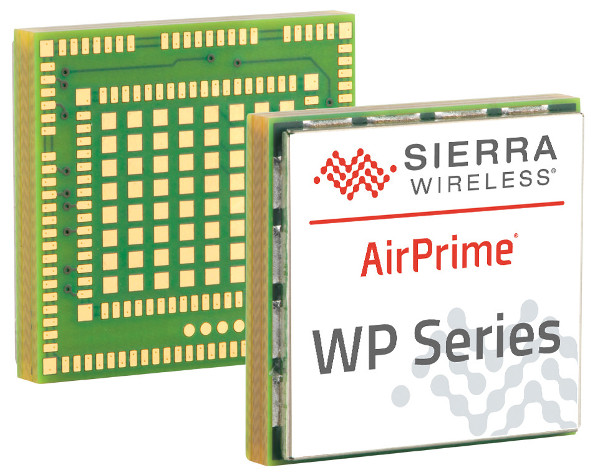

# ArduPilot Project
This project intends to port [ArduPilot](https://github.com/ArduPilot/ardupilot) firmware on new hardware base on embedded Linux multiple-core system and ESP32.
The main purpose of this project is to extend Modular design & hardware abstract layer base on processing and task.
ESP32 is doble core processor with mature RTOS firmware 

## Project Motivation ##
This idea came to mind when I intent to add camera on Ardupilot hardware and establish the video link under 4G network. 
SimCom 7100 & 7600 were first choice as I was familiar with Arduino GPRS shield made of SimCom product and are cheap , 
however after digging around those product I’ve noticed  the only available firmware (AT Command) is not mature enough to add camera and work as slave supplementary hardware for Ardupilot master board .
Unfortunately [SimCom]() has not provided yet any open SDK for IoT developer , hence I look to the other 4G modules in market such as [Telit]( https://www.telit.com)  , [InnoCom]( https://www.innocomm.com), [Gemalto]( https://www.gemalto.com), [Multitech]( https://www.multitech.com/), [Sierra Wireless]( https://www.sierrawireless.com), [Quectel]( https://www.quectel.com)
I found [Airprime WPx5xx-76xx series](https://source.sierrawireless.com/devices/wp-series/wp7502/) very Promising and elegant. 
while Airprime series has powerful and rich hardware with multi core, it also  embedded with Linux and open source SDK  for IoT developer 
summary of this product specification  come as follow
The AirPrime WP75xx/AirPrime WP8548 is a powerful multiple-core system that includes:
- One QDSP6 core, embedding Telecom firmware with integrated cellular voice (future firmware release), data and wireless Internet connectivity
- One Cortex-A5 core entirely dedicated to customer application and natively provided with Linux operating system
The application processor memory is dedicated to the Legato platform, including:
    -Linux kernel
    -Root file system
    -Application framework
    -Customer applications

- Memory Details WP75xx / WP8548
Flash Total 512 MB
    -256 MB Reserved for Application processor 
- RAM Total 256 MB
    -128 MB Reserved for Application processor 

## Milestone ##
- Hardware Design:
  - ***4G board***: base on Airprime
  - ***ESP32 board***:   
  - ***Input board***:   
  - ***Output board***:   
- Hardware prototype:  
- Firmware porting: 
- Test & debug: 

## License ##

This project is licensed under the GNU General Public License, version 3.
